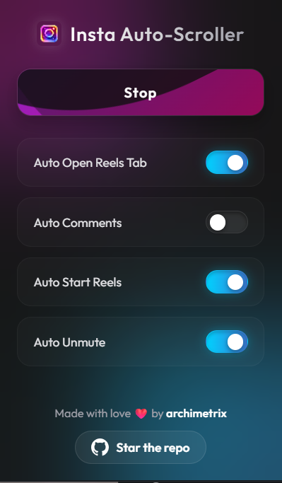

# 📱 Insta Auto-Scroller

A premium, modern Chrome extension that upgrades your Instagram Reels experience by automating tedious tasks. Sit back and watch—no more manual scrolling or unmuting.

Features a sleek, edge-to-edge glassmorphism UI with animated liquid gradients and customizable toggles.

## ✨ Features

* **Auto Open Reels Tab:** Instantly redirects you to the Reels feed whenever you visit the Instagram homepage (toggleable).
* **Auto-Scroll Reels:** Automatically seamlessly scrolls to the next reel the moment the current one finishes.
* **Auto-Open Comments:** Automatically opens the comments section on every reel as soon as it comes into view.
* **Auto-Unmute:** Ensures reels are unmuted by default so you never miss the audio.
* **Modern UI:** A stunning, fully custom interface featuring floating background orbs, frosted glass elements, and a liquid-animated start button.
* **Download Reels** Download reels with one click the modern extension will handle the download automatically through a external downloader .

## 🚀 How to Install (Developer Mode)

Since this extension is highly customized, you can install it directly from this repository in just a few steps:

1.  **Download the project:**
    * Clone this repository:
        ```bash
        git clone [https://github.com/Archimetrix/insta-auto-scroller.git](https://github.com/Archimetrix/insta-auto-scroller.git)
        ```
    * *Or* click the green **Code** button at the top of this page and select **Download ZIP**, then extract the folder.
2.  **Open Chrome Extensions:**
    * Navigate to `chrome://extensions/` in your Chrome browser.
3.  **Enable Developer Mode:**
    * Toggle the **Developer mode** switch in the top-right corner.
4.  **Load the Extension:**
    * Click the **Load unpacked** button in the top left.
    * Select the extracted `insta-auto-scroller` folder (make sure you select the folder containing the `manifest.json` file).
5.  **Pin it:** Click the puzzle piece icon in Chrome and pin the extension for easy access!

## 🛠️ Tech Stack

* **Manifest V3:** Built using the latest Chrome Extension architecture.
* **Vanilla JS:** Lightweight, fast DOM manipulation with `IntersectionObserver` and `MutationObserver` for single-page app support.
* **CSS3:** Advanced styling using `backdrop-filter` for glassmorphism and keyframe animations.

## 📸 Screenshots

* 

## 🤝 Contributing

Contributions, issues, and feature requests are welcome! Feel free to check the [issues page](../../issues).

---

Made with love ❤️ by [archimetrix](https://github.com/Archimetrix/insta-auto-scroller)
